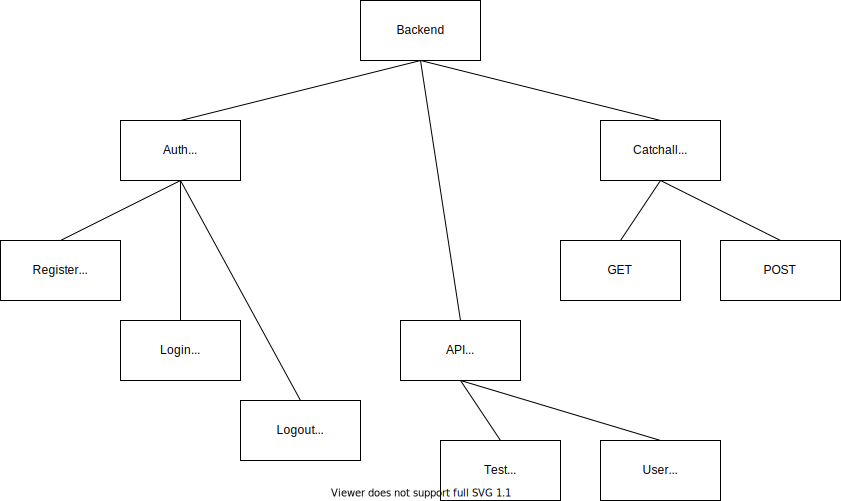

# node-headless-sample

The goal of this project is to create a sample development environment for a headless NodeJS server and static React site.
The backend and frontend are proxied through Nginx so both can be served from the same domain to simplify authentication.

## The Backend

- Node / Typescript
- Passport session auth with local strategy
- MongoDB for User records
- Redis for session storage
- API enpoints and socket connection are protected by session authentication
- Tests cover standard operation and test for various Bad Request scenarios
- Tests mock Mongo & Redis with in-memory databases

## The Frontend

- React (create-react-app)
- Simple tests on each component
- Development mode hot loading proxied through Nginx

## Github Actions

Working samples of useful CI/CD tasks for development are included.
When a PR is created in Github, these _actions_ will fire:

- Test backend
- Test frontend
- NPM audit backend
- NPM audit frontend

_Find these in `.github/workflows/*.yml`_

## Dev Usage

### Install

```bash
docker-compose run frontend npm install
docker-compose run backend npm install
```

### Run

```bash
docker-compose up -d
```

### Watch container console logs

```bash
# If the containers are up
docker-compose logs -f frontend
docker-compose logs -f backend
docker-compose logs -f nginx
docker-compose logs -f mongo
docker-compose logs -f redis
```

### Test

```bash
# If the containers are already up
docker-compose exec frontend npm test
docker-compose exec backend npm test

# Else if the containers are not already up
docker-compose run frontend npm test
docker-compose run backend npm test
```

### NPM

It is recommended to use NPM via the docker containers rather than from the host terminal.

```bash
# Assuming the containers are already up
docker-compose exec backend npm install foo-package
```

### Manually test with the web client app

Open [http://localhost:8080](http://localhost:8080) in a browser.

## Additional notes

**nodemon can't find dist/src/server.js**

- Not a large issue
- This will happen on the first run because the repo is ignoring _backend/dist/\*_ so that file doesn't exist yet.
- As soon as any \*.ts file change happens in the _backend/src/_ directory, `tsc` will build for the first time and all should be well.

**Mongoose fixed version**

- In the _backend_ directory, `package.json` has fixed versions for packages `mongoose` and `@types/mongoose`.
- Older versions of those packages are being used on purpose because of [this issue](https://github.com/Automattic/mongoose/issues/9606)
- At some point in the future it would wise to use the latest version of `mongoose` and thereby negate the need for `@types/mongoose`.

**Mongo in-memory DB for tests**

- During normal operation the app will connect to the MongoDB at `process.env.MONGO_URL`. When tests are run, that variable is overwriten to use the in-memory database thanks to `@shelf/jest-mongodb`.
- The tests that involve database interaction have an `afterAll()` that close the Mongo database connection. Without that, some tests will _hang_ and not close predictably.

**Utilities**

- The helper utilities in `backend/util/` are nothing special. Consider them dumb helpers and not something to be showcased in this sample.

## Hierarchy


