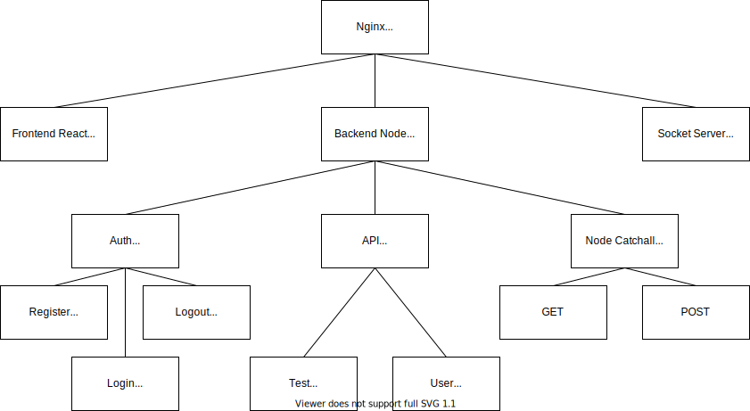

# node-headless-sample

The goal of this project is to create a sample development environment for a headless NodeJS server and static React site.
The backend and frontend are proxied through Nginx so both can be served from the same domain to simplify authentication.

## The Backend

- Node / Typescript
- Passport session auth with local strategy
- MongoDB for User records
- Redis for session storage
- API enpoints and socket connection are protected by session authentication
- Tests cover standard operation and test for various Bad Request scenarios
- Tests mock Mongo & Redis with in-memory databases

## Backend structure notes

- The Validate utility is overly simple and not recommended for production.
- The GlobalReply utility is an opinionated approach, YMMV.
- During normal operation the app will connect to the MongoDB at `process.env.MONGO_URL`. When tests are run, that variable is overwriten to use the in-memory database thanks to `@shelf/jest-mongodb`.
- The tests that involve database interaction have an afterAll() that close the database connection. Without that, some tests will _hang_ and not close predictably.

## The Frontend

- React (create-react-app)
- Simple tests on each component
- Development mode hot loading proxied through Nginx

## Github Actions

Included are some working samples of useful CI/CD tasks for development.
When a PR is created in Github, these _actions_ will fire:

- Test backend
- Test frontend
- NPM audit backend
- NPM audit frontend

## Dev Usage

### Install

```bash
docker-compose run frontend npm install
docker-compose run backend npm install
```

### Run

```bash
docker-compose up -d
```

### Watch container console logs

```bash
docker-compose logs -f frontend
docker-compose logs -f backend
docker-compose logs -f nginx
docker-compose logs -f mongo
```

### Test

```bash
docker-compose exec frontend npm test
docker-compose exec backend npm test
```

### NPM

It is recommended to use NPM via the docker containers rather than from the host terminal.

```bash
docker-compose exec backend npm install some-package
```

### Browser test with web client app

_Open [http://localhost:8080](http://localhost:8080) in a browser_.

## Hierarchy


